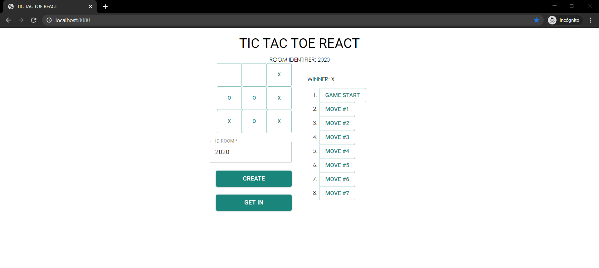
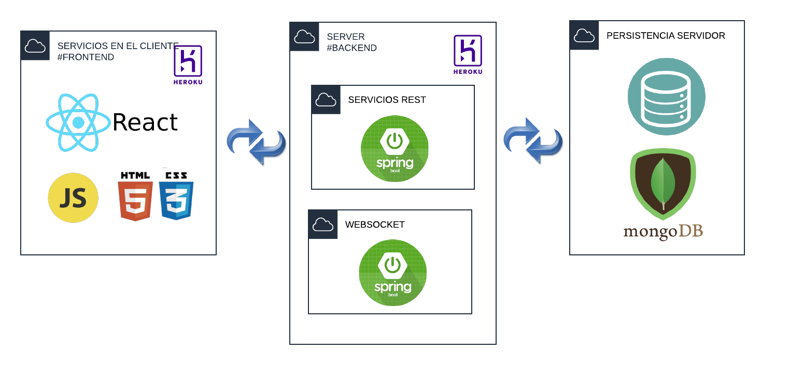

# Tic Tac Toe interactive

Learn how to build a Tic Tac Toe Game, From this Game build an interactive application using websockets.

# START

Copie el proyecto via git clone en cualquier diretorio para empezar a trabajar:
```
git clone https://github.com/Juaco9502/TicTacToe-ARSW
```

## INSTALL

1. Run in terminal:

```
$$ mvn clean package
```

2.(Optional):
If you want to view the documentation of the application, execute the following command and check the following path: root / target:

```
mvn javadoc:javadoc
```

Option 2:

```
java -jar target/ticTacToe-1.0-SNAPSHOT.jar
```

3. (Run):
The following command must be used in the project root folder:
  
```
mvn spring-boot:run
```

4. Open the web browser and enter the following address:


## HOME
```
http://localhost:8080
```



### DIAGRAM




## HEROKU
* [HOME](https://tic-tac-toe-arsw.herokuapp.com/) - https://tic-tac-toe-arsw.herokuapp.com/

## PRE-REQUISITES

* Java jdk > 7
* Maven (Apache Maven)
* Git
  

## BUILT

* [Maven](https://maven.apache.org/) - Dependency Management
* [JAVA JDK 8](http://www.oracle.com/technetwork/java/javase/overview/index.html) - Building
* [JUnit 3.8.1](https://mvnrepository.com/artifact/junit/junit/3.8.1) - Test
* [Spring Framework 2.3.1](https://spring.io/projects/spring-framework) - Framework


## AUTHOR

* **JUAN CAMILO ORTIZ MEDINA** - [Juaco9502](https://github.com/juaco9502)


## LICENSE

This project is licensed under the GNU General Public License - [LICENSE](LICENSE) 
